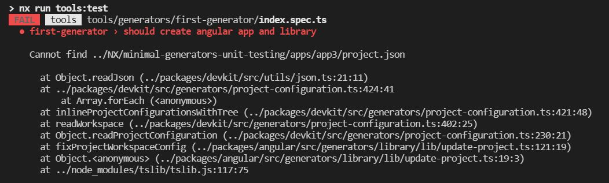

# MinimalGeneratorsUnitTesting

To reproduce the issue, run `nx test tools`

Error occurs in following scenario :

* While running unit test on a workspace generator where two or more @nrwl/angular generators are called sequentially with standaloneConfig set to true

Error doesn't occur in following scenarios :

* Actual execution of the generator gives expected result without any errors. Error occurs only while running unit tests
* If standaloneConfig is set to false, no error occurs

Error screenshot :

